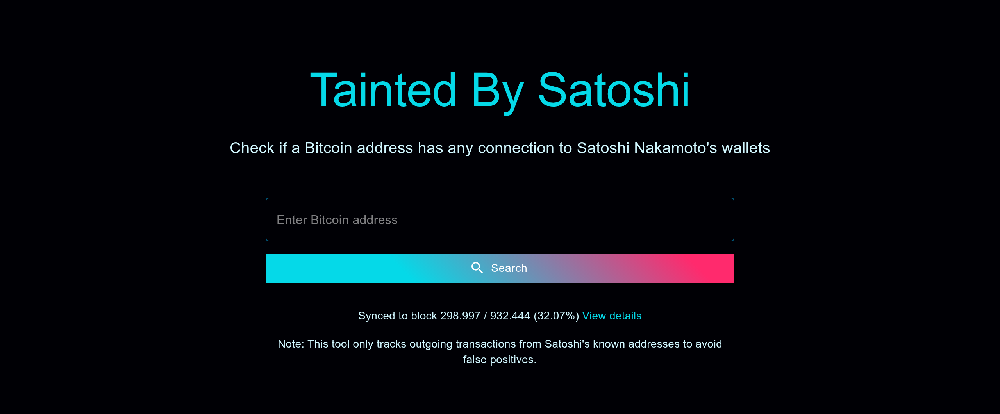

# 🫟 Tainted By Satoshi



Web application that lists every Bitcoin wallet connected to Satoshi Nakamoto and the hop count of that connection.

**Try it live:** [TaintedBySatoshi.com](https://taintedbysatoshi.com)

## Features

- List every wallet that received coins originating from Patoshi/Satoshi coinbases
- Show the shortest hop count and the reconstructed parent path
- Persist only live tainted UTXOs plus one compact record per wallet
- Uses verified Patoshi pattern analysis (21,953 blocks)
- Privacy-respecting analytics (no cookies, anonymous data)
- Background blockchain synchronization from genesis

## Quick Start

### Prerequisites

- Node.js 24.19.0 LTS or newer Node 24 release
- Bitcoin Core v22+ with `txindex=1` enabled
- Fast local disk for the taint database (NAS/CIFS is supported but slower)

### Installation

```bash
git clone https://github.com/MikelCalvo/TaintedBySatoshi.git
cd TaintedBySatoshi

# Install dependencies
cd backend && npm ci
cd ../frontend && npm ci
```

### Configuration

**Backend** (`backend/.env`):
```env
PORT=3001
BITCOIN_RPC_HOST=localhost
BITCOIN_RPC_PORT=8332
BITCOIN_RPC_USER=your_username
BITCOIN_RPC_PASS=your_password
DB_PATH=./data/satoshi-transactions
```

**Frontend** (`frontend/.env`):
```env
NEXT_PUBLIC_API_URL=http://localhost:3001
```

### Run Development

```bash
# Terminal 1: Backend
cd backend && npm run dev

# Terminal 2: Frontend
cd frontend && npm run dev
```

Access at http://localhost:3000

### Initialize Database

The first backend start extracts ~22,000 Patoshi addresses if needed, then scans from genesis. Schema version 4 stores live tainted UTXOs (`u:txid:vout`) and one compact hop record per wallet (`a:address`). Older databases cannot be resumed; wipe `DB_PATH` and rescan.

```bash
cd backend
npm run update-satoshi-data   # extracts Patoshi addresses only
npm run dev                   # starts the live UTXO scan
```

## Production

Use PM2 for production deployment:

```bash
# From root directory
npm run install:all
npm run build:frontend
npm run pm2:start
```

The backend auto-syncs new blocks in the background.

See [docs/DEPLOYMENT.md](docs/DEPLOYMENT.md) for full production setup.

## API

### `GET /api/check/:address`

Return the shortest hop count from Satoshi to an address.

**Response:**
```json
{
  "isConnected": true,
  "isSatoshiAddress": false,
  "degree": 3,
  "hops": 3,
  "origin": "1A1z...",
  "connectionPath": [
    {"from": "1A1z...", "to": "1BvB...", "txHash": "abc123...", "amount": 50, "hops": 1}
  ]
}
```

### Other Endpoints

| Endpoint | Description |
|----------|-------------|
| `GET /api/wallets` | Paginated list of tainted wallets and hop counts |
| `GET /api/sync-status` | Blockchain sync progress |
| `GET /api/health` | Health check |
| `GET /api/analytics/stats` | Public usage statistics |

## Documentation

- [Development Guide](docs/DEVELOPMENT.md) - Scripts, debugging, local setup
- [Deployment Guide](docs/DEPLOYMENT.md) - PM2, production, monitoring
- [Configuration Reference](docs/CONFIGURATION.md) - All environment variables
- [Patoshi Analysis](docs/PATOSHI.md) - Technical background on Satoshi identification

## Tech Stack

| Component | Technology |
|-----------|------------|
| Frontend | Next.js 16, Material UI 9, React 19 |
| Backend | Express.js, LevelDB |
| Bitcoin | bitcoinjs-lib, Bitcoin Core RPC |
| Process Manager | PM2 |

## Notes

- Only tracks **outgoing** taint from Patoshi/Satoshi coinbases. Paying a Satoshi address does not taint the sender.
- Supports all address types (P2PKH, P2SH, SegWit)
- Spent tainted outputs are deleted. The database grows with live UTXOs and unique wallets, not with full history.

## Contributing

1. Fork the repository
2. Create feature branch (`git checkout -b feature/amazing`)
3. Commit changes
4. Push and open PR

## License

[ISC](LICENSE.md)
